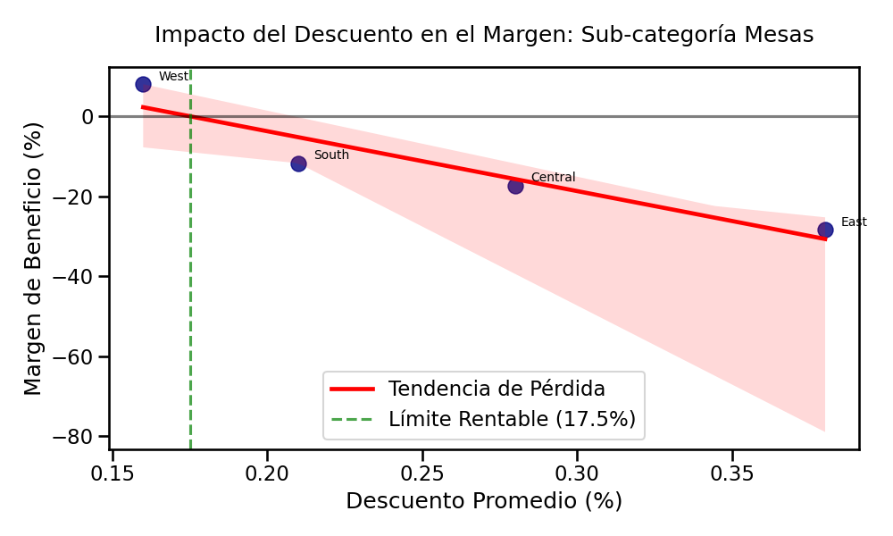

# 📊 Análisis de Rentabilidad y Optimización de Políticas de Precios (Superstore Dataset) 📉

## 🚀 Resumen Ejecutivo
En el sector retail, un alto volumen de ventas no siempre garantiza rentabilidad. Este proyecto documenta un análisis de datos End-to-End sobre el dataset de una "Superstore", con el objetivo de auditar la salud financiera del negocio. A través de análisis exploratorio (EDA) y modelado estadístico, se detectó una **fuga crítica de capital** oculta detrás de grandes volúmenes de ventas, culminando en el diseño de una política de descuentos estandarizada y basada en datos.

---

## 🛠️ Herramientas y Tecnologías Utilizadas
Para llevar a cabo este análisis, se construyó un pipeline de datos utilizando el ecosistema de **Python**:
* **Pandas:** Limpieza de datos, Feature Engineering (creación de la métrica `Margen_pct`), y agregaciones complejas (`groupby`, `agg`).
* **NumPy:** Modelado matemático y cálculo de la función polinómica para la regresión.
* **Matplotlib & Seaborn:** Creación de visualizaciones estáticas, ajuste de ejes, alineación de etiquetas y diseño de gráficos de sensibilidad.
* **Estadística Descriptiva e Inferencial:** Regresión Lineal Simple para modelar la relación *Causa-Efecto* entre variables comerciales.

---

## 🕵️‍♂️ Desarrollo del Análisis y Problemáticas Detectadas

El análisis se estructuró de "lo macro a lo micro", desglosando el problema en 4 fases clave:

### Fase 1: Análisis General de Tráfico y Ventas
**Problemática inicial:** Necesitábamos entender cómo se distribuye el esfuerzo comercial a lo largo de la semana para identificar los días de mayor impacto.

**Hallazgo:** Se trazó el flujo de ventas diario, estableciendo una línea base del comportamiento del consumidor a lo largo de la semana.

### Fase 2: La "Ilusión del Volumen" de los Lunes (Monday)
**Problemática:** Al evaluar el rendimiento del inicio de la semana (Lunes), descubrimos que no todas las categorías aportaban valor real a la empresa.

**Hallazgo:** Mientras *Office Supplies* y *Technology* mantenían márgenes saludables (22.40% y 12.28% respectivamente), la categoría **Furniture (Muebles)** colapsaba con un margen de apenas **2.91%**. El esfuerzo de ventas en muebles los lunes no estaba generando un retorno de inversión (ROI) justificable.

### Fase 3: Aislamiento del Foco de Pérdida (Drill-Down)
**Problemática:** Decir que "los muebles no son rentables" es muy ambiguo para tomar decisiones. Era necesario aislar exactamente qué productos estaban drenando la caja.

**Hallazgo:** Al hacer un *drill-down* dentro de Furniture, los datos revelaron que las **Mesas (Tables)** (-6.39%) y los libreros (Bookcases) operaban en números rojos. Las mesas representaban la mayor hemorragia financiera del catálogo.

### Fase 4: Modelado Estadístico y Causa Raíz
**Problemática:** ¿Por qué perdemos dinero en las mesas? ¿Es el costo de envío, el precio base o la política de promociones?

**Hallazgo y Modelado:** Se cruzó la variable de `Margen %` contra el `Descuento Promedio` aplicado en las distintas regiones. Utilizando una **Regresión Lineal Simple ($y = mx + b$)**, se demostró matemáticamente que la política de descuentos era la culpable directa de las pérdidas. La región **East** estaba aplicando descuentos promedio del 38%, garantizando una pérdida operativa total.

---

## 💡 Propuestas Estratégicas y Plan de Acción

Basado en el análisis de sensibilidad y la ecuación de regresión, se proponen las siguientes acciones inmediatas para el equipo directivo y comercial:

1. **Implementación de un Tope de Descuento (Breakeven):**
   * El modelo matemático indica que la línea de rentabilidad cruza el cero (Punto de Equilibrio) exactamente en el **17.5%**.
   * **Propuesta:** Bloquear por sistema cualquier descuento superior al **15%** para la subcategoría de Mesas.

2. **Reestructuración Comercial en la Región East:**
   * La región East está utilizando las mesas como "producto gancho" (Loss Leader) de forma descontrolada (38% de descuento).
   * **Propuesta:** Auditar a los gerentes de ventas de la región East y obligarlos a adoptar el marco de precios de la región **West** (que opera con un 16% de descuento y mantiene el margen positivo).

3. **Reevaluación de Campañas de Inicio de Semana:**
   * **Propuesta:** Reducir la inversión en marketing para la categoría de *Furniture* los días lunes y reasignar ese presupuesto a *Office Supplies*, maximizando el retorno de inversión donde el margen ya es orgánicamente del 22%.

4. **Alertas de Margen Negativo:**
   * **Propuesta:** Implementar un Dashboard dinámico que genere alertas en tiempo real cuando una transacción individual proyecte un margen negativo por culpa de una excepción en el descuento.

---
**👨‍💻 Autor:** Jeferson Cuadros Zurichaqui  
**💼 LinkedIn:** https://www.linkedin.com/in/jefersoncuadros/  
**📧 Contacto:** jcuadroszurichaqui@gmail.com
